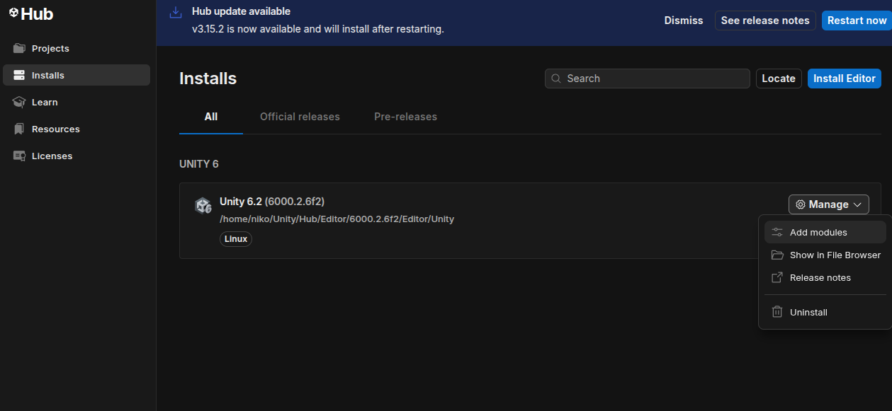
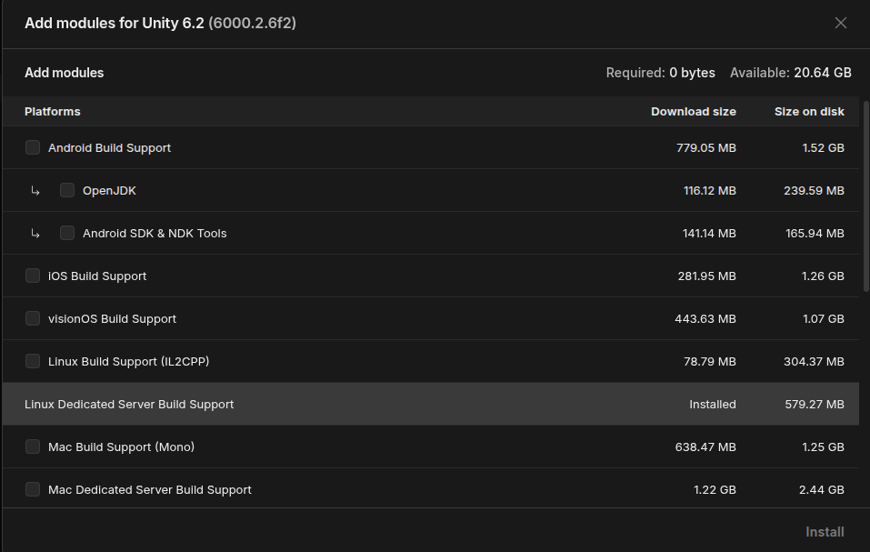
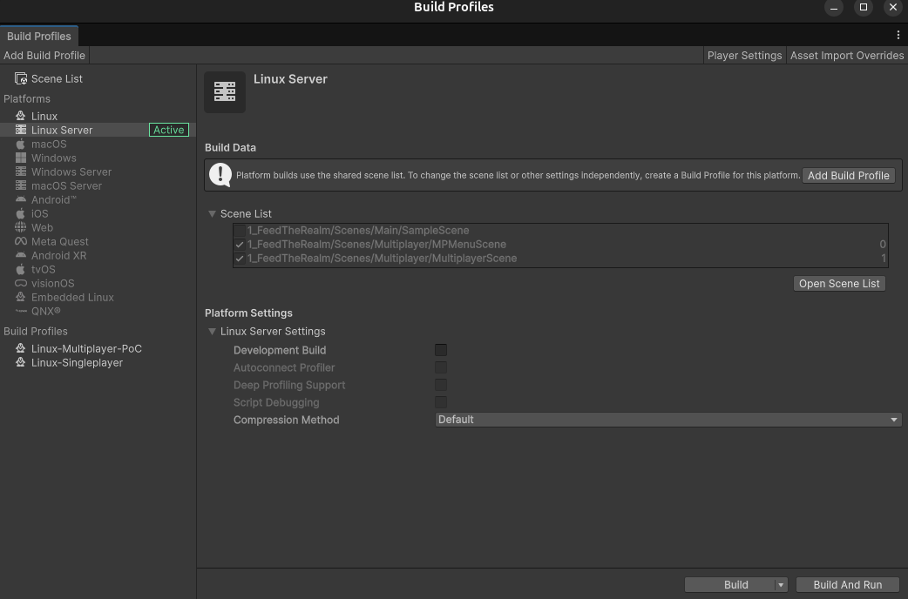

Added server headless build, but first if you want to make a build in server dedicated:

Install Dedicated Server Module:
In Unity Hub, ensure that the "Dedicated Server Build Support" module for Linux is installed for the specific Unity Editor version you are using.

You can do that on Unity hub:


then this module has to be installed (Linux Dedicated Server Build support):




Once installed, you can build with linux server mode:


Both scenes like in the image should be checked.

And run the server with the command on the build directory:
```
./mptest.x86_64 -port 7777 -address 0.0.0.0 -maxplayers 10
```

you can join after the server is up, using the unity editor or change build mode to "Linux-Multiplayer-PoC", or create a new one with both scenes "MPMenuScene" and "MultiplayerScene" checked, and build.
Then on the build folder you run:

```
./mptest.x86_64 -logfile debug.log
```

Then launch client or MPMenuScene on editor, then complete IP and Port, click Join button, and you are in!
